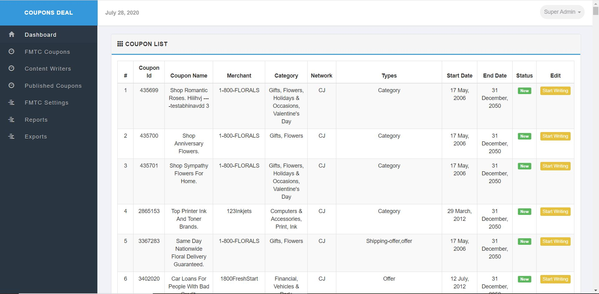
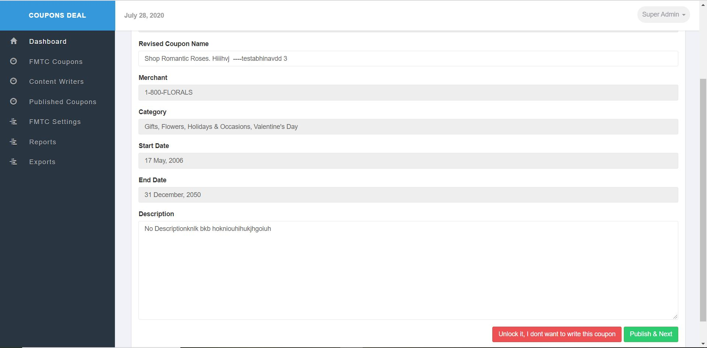

# PHP-Coupon-Management-Application
A Coupon Managment App with CRUD capability with multiple user level logins.
Also built in is public api support in folder 'api/' 

### Installing steps
****

1. Download the repo with git (`git clone https://github.com/kjain3474/PHP-Coupon-Management-Application.git`)

2. Open XAMPP Control Panel on your desktop and run Apache and MySQl services.

3. Import/load coupons.sql into your mysql database. This should load the coupon and user table in DB.

3. Modify the includes/config.php and change the variables to match your host, database, username and passwords for local setup.

4. run and access it http://localhost:80

5. Then loging by typing **username** and **password**:

   1) For Super Admin:
	  **username**  : admin
	  **password**  : admin
	
   2) For Content Writer:
	  **username**  : user
	  **password**  : user
	 

**Live App** : https://coupons-deal.herokuapp.com/index.php

App Snapshots:

